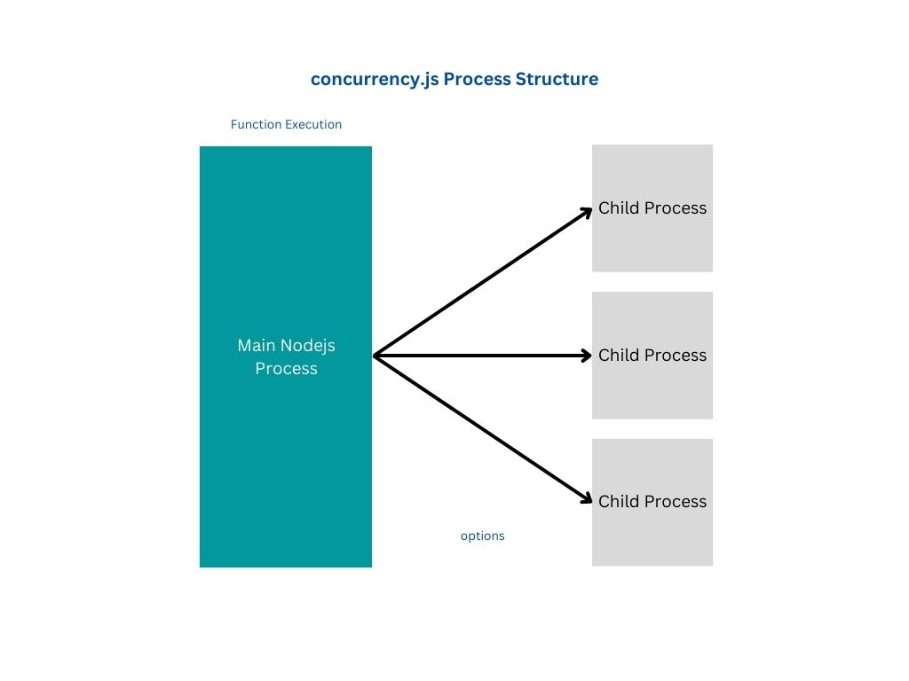
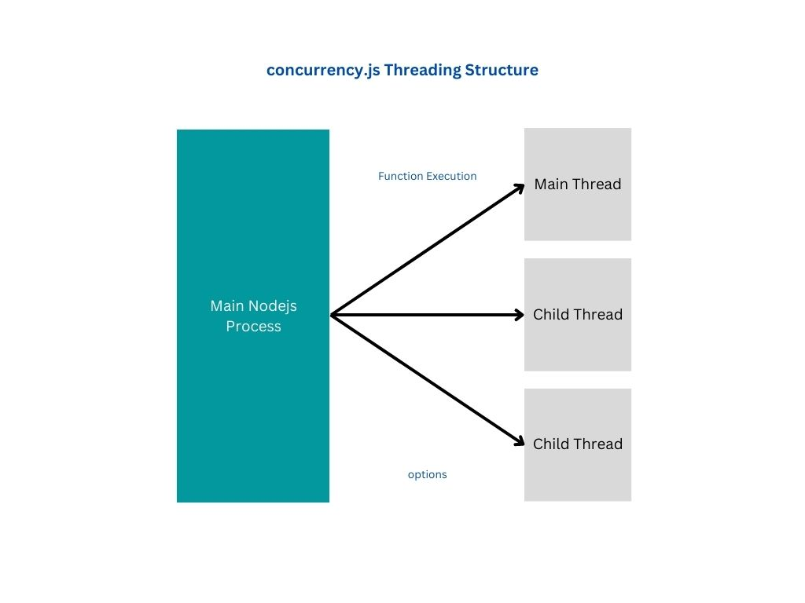

# concurrency.js

npm module to work with concurrency - worker threads and worker processes easily using simple functions and script files

Find the demos in the [demos folder](./demos)


## CONCURRENCY METHODS


`concurrency._concurrencyClusters(filename = __filename, num = cpus().length, options = {}, greet = false)`

`concurrency._concurrencyProcesses(filename = __filename, options = {}, greet = false)`

`concurrency._concurrencyThreads(filename = __filename, options = {}, greet = false)`

`concurrency._concurrencyThreadsAsync(command, options, nodeCmd = true)`

`loadbalancer.loadbalancer(serverOptions)`

`loadbalancer.processing(serverOptions)`

`loadbalancer.processingMultiple(serverOptions)`

`loadbalancer.clustering(serverOptions)`

`loadbalancer.threading(serverOptions)`

`loadbalancer.threadingMultiple(serverOptions)`


## Cluster Methods


Create a cluster of nodejs processes using a filename to fork

`_concurrencyClusters(filename = __filename, num = cpus().length, options = {}, greet = false)`

```

const path = require("path");
let { _concurrencyClusters } = require("concurrency.js");

function concurrency() {
    return new Promise(function (resolve, reject) {
        _concurrencyClusters(
            path.join("C:\\Users\\GB\\Documents\\projects\\requireurl\\concurrency\\src\\worker.cluster.js"),
            8,
            {
                data: {
                    data: "Testing parent data",
                    url: "https://www.google.com"
                },
                childData: "Test data from child"
            }
        ).then((d) => {
            console.log("Data fetched", JSON.stringify(d));
            resolve(d);
        }).catch((e) => {
            console.log(e.toString());
            reject(e);
        });
    });
}
concurrency();

```

```
// Any data type you wish to handle

options.data = {}

// All event handlers.
// The name of the key will be the exact event name in lowercase
// [TODO] consider parent child event handler names.
// Consider name all child thread, process, cluster process to be named as <childEVENT>.
// Example: childClose, childMessage

options.handlers = {
    message: () => {},
    error: () => {},
    exit: () => {},
    close: () => {}
}
```


## Process Methods


`_concurrencyProcesses(filename = __filename, options = {}, greet = false)`

```

const path = require("path");
let { _concurrencyProcesses } = require("concurrency.js");
_concurrencyProcesses(
    path.join(
    "C:\\Users\\GB\\Documents\\projects\\requireurl\\concurrency\\src\\worker.process.js"),
    {
        data: {
            message: "Testing data",
            url: "https://www.google.com"
        }
    },
    true
    ).then((d) => { console.log("Data fetched: ", JSON.stringify(d)); })
    .catch((e) => { console.log(e.toString()); setTimeout(() => { process.exit(e); }, 5000) })

```

```
// Any data type you wish to handle

options.data = {}

// All event handlers.
// The name of the key will be the exact event name in lowercase
// [TODO] consider parent child event handler names.
// Consider name all child thread, process, cluster process to be named as <childEVENT>.
// Example: childClose, childMessage

options.handlers = {
    message: () => {},
    error: () => {},
    close: () => {},
    childExit: () => {}
}
```




## Threads Methods


`_concurrencyThreads(filename = __filename, options = {}, greet = false)`

```

const path = require("path");
let { _concurrencyThreads } = require("concurrency.js");
_concurrencyThreads(
    __filename,
    {
        data: {
            url: "https://www.google.com",
            data: "Testing data"
        },
        childData: "Testing child data"
    },
    true
).then((d) => console.log(JSON.stringify(d)));

```

```
// Any data type you wish to handle

options.data = {}

// All event handlers.
// The name of the key will be the exact event name in lowercase
// [TODO] consider parent child event handler names.
// Consider name all child thread, process, cluster process to be named as <childEVENT>.
// Example: childClose, childMessage

options.handlers = {
    message: () => {},
    error: () => {},
    exit: () => {},
    close: () => {},
    childExit: () => {} // exception for child process exit event naming
}
```



## Thread Async Methods

`_concurrencyThreadsAsync(command, options, nodeCmd = true)`

```

const path = require("path");
let { _concurrencyThreadsAsync } = require("concurrency.js");

let threads = _concurrencyThreadsAsync(
    "C:\\Users\\GB\\Documents\\projects\\requireurl\\concurrency\\demos\\demos.threads.js",
    {
        data: {
            data: "Testing parent data",
            url: "https://www.google.com"
        },
        childData: "Test data from child"
    }
);

```


## Loadbalancer Methods

Create loadbalancer threads.


```
'use strict';

var loadbalancer = require("loadbalancer").loadbalancer;
var httpSocketServer = require("../index").sockets.httpSocketServer;
var server = require("./express-app");

loadbalancer.loadbalancer({
    "server": server,
    "protocol": "http", // https
    "createCerts": true,
    "host": "localhost",
    "proxy": {
        "proxy": true,
        "protocol": "http",
        "host": "localhost",
        "port": 7000,
        "proxyHost": "",
        "proxyPort": 9000
    },
    "certs": {
        "key": "./certs/ssl.key",
        "cert": "./certs/ssl.cert"
    },
    "port": 8000,
    "ws": true,
    "processes": 5,
    "threads": 10,
    "mainProcessCallback": () => { },
    "forkCallback": (opts, pr) => {
        // console.log(opts, pr);
        // console.log(opts);
        httpSocketServer(opts);
    },
    "callbacks": {
        "wsOnData": null,
        "wsOnEnd": null,
        "wsUpgrade": null,
        "server": null,
        "listen": null
    }
})
```


### Contributions

Contributions, Feature Improvements, Bugs, and Issues are invited. [raising an issue](https://github.com/ganeshkbhat/concurrency.js/issues)

### TODO

[Todo](./todo)

# License

[MIT License](./LICENSE)
